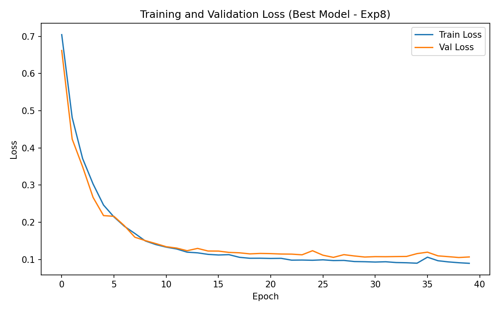
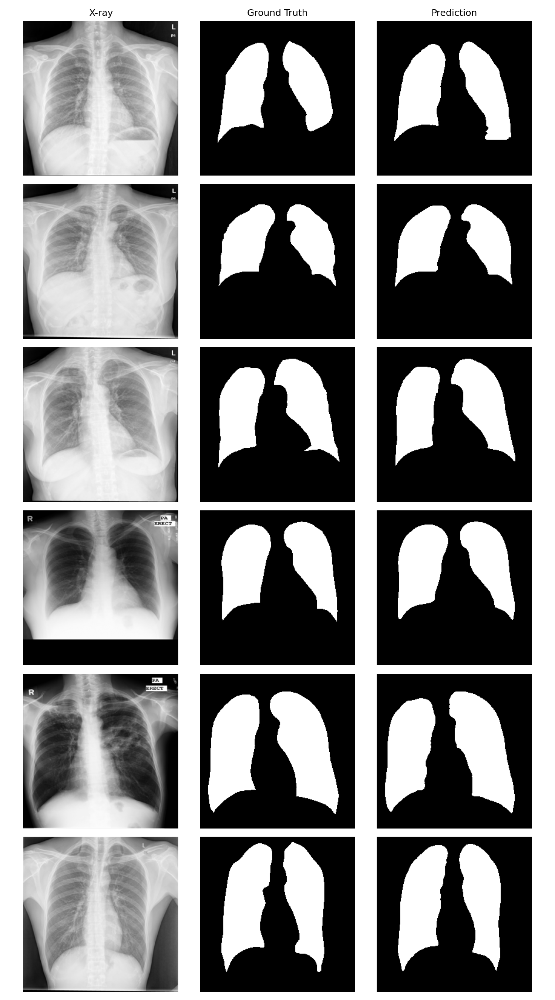

# U-Net Chest X-Ray Lung Segmentation - Report

## Introduction

I implemented a U-Net model for lung segmentation on chest X-ray images. The goal is to predict binary lung masks from grayscale X-ray images. U-Net is a natural choice for medical image segmentation because of its encoder-decoder structure with skip connections, which helps preserve spatial details while learning high-level features. The dataset comes from Kaggle's "Chest X-ray Masks and Labels" collection.

## Dataset Description

- **Source:** [Kaggle - Chest X-ray Masks and Labels](https://www.kaggle.com/datasets/nikhilpandey360/chest-xray-masks-and-labels)
- **Total image-mask pairs:** 704
- **Original resolution:** Variable (~3000x3000 pixels)
- **Mask values:** Binary (0 and 255), binarized to 0/1 during preprocessing
- **Channels:** Grayscale (single channel)

**Preprocessing:**
- Resized all images and masks to 256x256
- Normalized pixel values to [0, 1]
- Binarized masks with threshold at 127
- Train/val/test split: 70/15/15 (492/106/106 images)

## Model Architecture

Standard 4-level U-Net with a bottleneck:

| Level | Encoder | Decoder |
|-------|---------|---------|
| 1 | Conv(1->64) + BN + ReLU x2 | Conv(128->64) + BN + ReLU x2 |
| 2 | Conv(64->128) + BN + ReLU x2 | Conv(256->128) + BN + ReLU x2 |
| 3 | Conv(128->256) + BN + ReLU x2 | Conv(512->256) + BN + ReLU x2 |
| 4 | Conv(256->512) + BN + ReLU x2 | Conv(1024->512) + BN + ReLU x2 |
| Bottleneck | Conv(512->1024) + BN + ReLU x2 | - |

- **Downsampling:** MaxPool2d(2) between encoder levels
- **Upsampling:** ConvTranspose2d(kernel=2, stride=2) in decoder
- **Skip connections:** Concatenation of encoder features with decoder features
- **Output:** 1x1 Conv to single channel (logits)
- **Total parameters:** 31.04M

## Training Setup

- **Loss function:** BCE + Dice combined loss (best config)
- **Optimizer:** Adam
- **Learning rate:** 3e-4
- **Batch size:** 8
- **Image size:** 256x256
- **Epochs:** 40
- **Augmentation:** Random horizontal flip (50% probability)
- **Train/val/test split:** 70/15/15 with random_state=42

## Experiments and Hyperparameter Tuning

I ran 8 experiments total, testing one change at a time. All experiments used the same train/val/test split for fair comparison.

| Experiment | Change | Dice | IoU | Kept? |
|------------|--------|------|-----|-------|
| Baseline | lr=1e-3, bs=8, BCE, 25ep | 0.9630 | 0.9299 | yes |
| Exp 2 | lr=3e-4 | 0.9637 | 0.9311 | yes |
| Exp 3 | lr=1e-4 | 0.9616 | 0.9272 | no |
| Exp 4 | bs=16, lr=3e-4 | 0.9623 | 0.9284 | no |
| Exp 5 | bs=4, lr=3e-4 | 0.9633 | 0.9303 | no |
| Exp 6 | BCE+Dice loss, lr=3e-4, bs=8 | 0.9647 | 0.9331 | yes |
| Exp 7 | h-flip augmentation, lr=3e-4, bs=8 | 0.9640 | 0.9317 | yes |
| Exp 8 | 40 epochs, BCE+Dice, aug, lr=3e-4 | **0.9648** | **0.9330** | **BEST** |

**Key observations:**
- lr=3e-4 outperformed both 1e-3 and 1e-4. The default 1e-3 was already quite good, and 1e-4 was too slow to converge in 25 epochs.
- Batch size didn't matter much. bs=8 was a good sweet spot.
- BCE+Dice combined loss gave a noticeable boost over plain BCE (0.9647 vs 0.9637).
- Horizontal flip augmentation helped slightly.
- Training for 40 epochs instead of 25 squeezed out a tiny bit more, giving the best overall result.

## Final Hyperparameters

| Parameter | Value |
|-----------|-------|
| Learning rate | 3e-4 |
| Batch size | 8 |
| Image size | 256x256 |
| Epochs | 40 |
| Optimizer | Adam |
| Loss function | BCEWithLogitsLoss + DiceLoss |
| Augmentation | Random horizontal flip (p=0.5) |
| Encoder channels | 64, 128, 256, 512 |
| Bottleneck channels | 1024 |
| Input channels | 1 (grayscale) |
| Output channels | 1 (binary mask) |

## Results

**Final test set performance:**
- **Dice coefficient:** 0.9648
- **IoU (Jaccard):** 0.9330

### Training Loss Curve

The training and validation losses both decrease steadily and plateau around epoch 25-30, confirming convergence.

### Sample Predictions

The predictions are visually very close to the ground truth masks. The model accurately captures lung boundaries even in challenging cases.

## Conclusion

A vanilla U-Net achieves strong performance on chest X-ray lung segmentation with a Dice score of 0.9648 and IoU of 0.9330. The most impactful changes were using a combined BCE+Dice loss function and lowering the learning rate to 3e-4. Adding augmentation and training longer provided marginal additional gains. The model generalizes well, as evidenced by the small gap between training and validation metrics.
## References

1. Dan et al. (2024). Enhancing medical image segmentation with a multi-transformer U-Net. PeerJ, 12, e17005.
2. Nillmani et al. (2022). Segmentation-Based Classification Deep Learning Model Embedded with Explainable AI for COVID-19 Detection in Chest X-ray Scans. Diagnostics, 12(9), 2132.
3. Saber et al. (2025). Efficient and Accurate Pneumonia Detection Using a Novel Multi-Scale Transformer Approach. arXiv:2408.04290.
